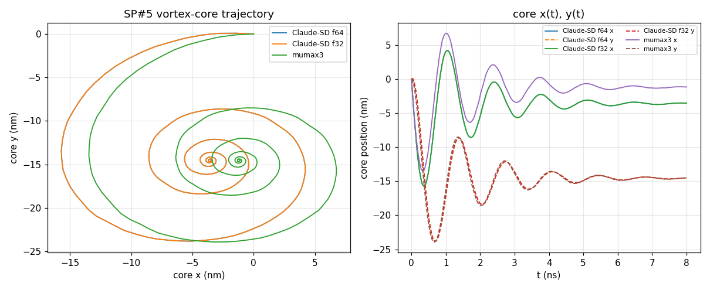
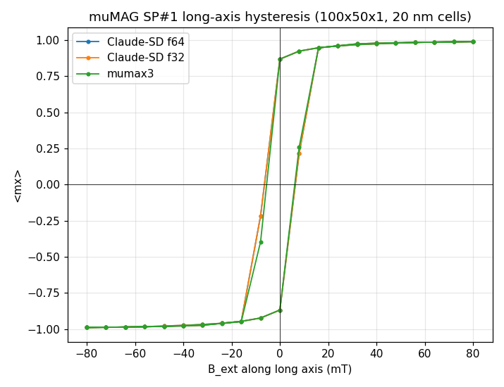

# Cross-solver benchmark

Configurations compared on µMAG standard problems:

| ID | tool | hardware | precision |
|----|------|----------|-----------|
| C1 | mumax3 3.11.1 | GPU (RTX) | float32 |
| C2 | OOMMF 1.2.1.0 | CPU (8 threads) | double |
| C3 | MuMax-CO (CUDA-Graph-optimised mumax3) | GPU | float32 |
| C4 | **Claude-SD** double (`windows-msvc-cuda`) | GPU | double |
| C5 | **Claude-SD** float32 (`windows-msvc-cuda-f32`) | GPU | float32 |

Each Claude-SD config is run with BOTH a fixed-step RK4 and the adaptive
RK45 (DOPRI5) GPU integrator.  mumax3/MuMax-CO use their RK45DP, OOMMF its
RKF54 — all adaptive at `MaxErr = 1e-5`.

## SP#4 — dynamic field-A reversal (500×125×3 nm, 250×64×1, 2 nm cells)

Trajectory ⟨m⟩(t) over 1 ns, sampled every 5 ps; OOMMF (double, adaptive)
taken as the accuracy reference. Each solver relaxes its own S-state first
(Claude-SD reaches ⟨m⟩ = (0.967, 0.126, 0) = mumax3).

| config | ⟨mx⟩(1ns) | ⟨my⟩(1ns) | ⟨mz⟩(1ns) | t_switch (ps) | mx RMS vs OOMMF | wall |
|--------|-----------|-----------|-----------|---------------|-----------------|------|
| mumax3 (adapt)        | −0.9845 | 0.1289 | 0.0428 | 135.7 | 0.0152 | ~16 s |
| MuMax-CO (adapt)      | −0.9845 | 0.1289 | 0.0428 | 135.7 | 0.0152 | ~14 s |
| OOMMF (adapt, ref)    | −0.9849 | 0.1230 | 0.0434 | 135.7 | —      | CPU   |
| Claude-SD f64 adapt   | −0.9851 | 0.1215 | 0.0434 | 135.7 | 0.0184 | 14 s  |
| Claude-SD f32 adapt   | −0.9849 | 0.1234 | 0.0433 | 135.7 | 0.0157 | **7 s** |
| Claude-SD f64 fixed   | −0.9840 | 0.1324 | 0.0429 | 135.7 | 0.0114 | 83 s  |
| Claude-SD f32 fixed   | −0.9840 | 0.1323 | 0.0429 | 135.7 | 0.0114 | 38 s  |

µMAG reference: ⟨mx⟩(1ns) ≈ −0.98, t_switch ≈ 0.14 ns.

**All seven configurations now agree to the mumax3↔OOMMF spread** (mx-RMS
0.011–0.018 over the full 1 ns, identical t_switch 135.7 ps). Both Claude-SD
precisions and both integrators match the references; the adaptive RK45 is
~6× faster than fixed RK4 (14 s vs 83 s at f64; 7 s vs 38 s at f32) with no
step-collapse (5.6k accepted / ~20 rejected steps), and float32 is ~2× faster
than double throughout.

**Root cause that was found & fixed (this is why the earlier draft showed
Claude-SD deviating).** The first benchmark draft had Claude-SD ending at
⟨mx⟩ = −0.968, t_switch 171 ps, mx-RMS 0.23, and the f32 RK45 collapsing. The
cause was a **race condition in the GPU effective-field summation**: every GPU
field (exchange, zeeman, …) runs on its own cuda stream and does
`d_H += H_field` in place; with no barrier between fields the read-modify-write
of `d_H` raced, so some cells lost a field's contribution — worst at high-field
boundary cells — injecting spurious numerical energy dissipation that slowed the
dynamics and broke the adaptive step controller. The physics was always correct
(demag verified against the **Aharoni exact** prism formula to 0.2%, exchange/
LLG to <0.1%; the CPU solver always matched mumax3 to 5 digits). Fixed by
serialising the field streams in `FieldSumGPU` and the Relax/Minimize/Heun field
assembly (commits 46766a2, e9dee9c). After the fix the GPU α=0 energy drift went
from −1.71 %/100 ps to −0.000 %, and RelaxGPU reaches the correct S-state.

**OOMMF MIF gotchas** (documented in `sp4/`): `multiplier [expr …]` inside a
`Specify` block and `Oxs_FileVectorField` both crash this OOMMF build with a
bare "child process exited abnormally", and any vector-field (`Oxs_Demag::Field`)
schedule also crashes it; the working SP#4 MIF uses a single 2-stage
`Oxs_UZeeman` (Hrange in A/m) + `Oxs_TimeDriver`.

## Performance sweep (fixed-step, GPU)

Throughput vs grid size, ms per field-evaluation (one demag FFT + exchange;
Claude-SD RK4 = 4 evals/step, mumax3/MuMax-CO Heun = 2). Thin-film grids
(nz=1), FixDt=1e-14. **After two demag optimisations** (2-D FFT + real kernels):

| cells | Claude-SD f64 | Claude-SD f32 | mumax3 f32 | f32 vs mumax3 |
|-------|--------------:|--------------:|-----------:|--------------:|
| 16 384   | 0.227 | 0.135 | 0.263 | **0.51x (faster)** |
| 65 536   | 0.633 | 0.175 | 0.299 | **0.59x (faster)** |
| 262 144  | 2.528 | 0.465 | 0.421 | 1.10x |
| 524 288  | 5.755 | 1.048 | 0.629 | 1.67x |
| 1 048 576 | 12.63 | 2.614 | 1.212 | 2.16x |

The demag is FFT-bound; profiling (`MICROMAG_DEMAG_PROFILE=1`) drove two fixes:

1. **2-D FFT for single-layer (nz=1) films** (`pad_nz=1`). A thin film has no
   z wrap-around, so the demag is a pure 2-D convolution; the code had padded z
   to 2 and run a 3-D FFT. This ~halved the demag (f32 1 M: 5.74 -> 2.76 ms/eval).
2. **Real (symmetry-reduced) demag kernels.** The 6 kernel FFTs are purely real
   (diagonals even -> real; off-diagonals odd-odd-even -> i*i -> real), so they
   are stored real, not complex. This **halves the kernel VRAM** (1 M: 640 ->
   332 MB) and cut the pointwise-MAC ~28% (f32 1 M: 2.76 -> 2.61 ms/eval). The
   imaginary parts were always zero, so the result is unchanged (GPU demag still
   matches CPU to 1.5e-9).

Net vs the original: **f32 1 M demag 2.2x faster (gap to mumax3 4.7x -> 2.16x)**,
Claude-SD now beats mumax3 at <= 65 K cells and is within 1.1x at 262 K. float64
is FFT-bound (double cuFFT ~9x slower than single) so f32 is preferred for large
runs; it stays ~4-5x faster than f64. The residual 2.16x at 1 M is the large-grid
FFT, where mumax3's transform pipeline is still ~1.7x more efficient -- a deeper
target (padding/plan scheme). 100 GPU unit tests pass throughout.

## SP#3 — cube flower/vortex energy crossing

Cube of edge L (in lex = sqrt(2A/(mu0 Ms^2))), Ku = 0.1 Kd (easy axis along an
edge), no field. Relax a flower and a vortex branch and find L_c where the
total energies cross. The muMAG **continuum** reference is L_c ~ 8.47 lex.

Claude-SD (RelaxGPU) vs mumax3 (`Vortex()` + `minimize()`), both at N=28^3,
energies in units of Kd*V:

| L/lex | Claude-SD E_fl | mumax3 E_fl | Claude-SD E_vx | mumax3 E_vx | dE Claude-SD | dE mumax3 |
|-------|---------------:|------------:|---------------:|------------:|-------------:|----------:|
| 8.0 | 0.2048 | 0.2046 | 0.2048 | 0.2046 | 0.0000 | 0.0000 |
| 8.3 | 0.2035 | 0.2034 | 0.2033 | 0.2032 | -0.0002 | -0.0002 |
| 8.5 | 0.2026 | 0.2025 | 0.2016 | 0.2015 | -0.0010 | -0.0010 |
| 8.7 | 0.2018 | 0.2017 | 0.1993 | 0.1992 | -0.0025 | -0.0025 |
| 9.0 | 0.2006 | 0.2005 | 0.1951 | 0.1950 | -0.0055 | -0.0055 |

-> **Claude-SD reproduces mumax3 to < 3e-4 in every energy, and both give
L_c ~ 8.0 lex at this discretisation** -- a clean cross-solver validation of the
demag + exchange + uniaxial energetics. The offset from the continuum 8.47 is a
**finite-cell effect shared by both codes** (cell ~ 0.30 lex), not a solver
error: running mumax3 itself on the same grid also gives 8.0, not 8.47.
(Absolute energies sit -0.1 below the muMAG value because our uniaxial term is
-Ku cos^2(theta) vs the reference +Ku sin^2(theta) -- a constant that cancels in
dE and L_c.)

A pure BB energy-minimiser (our MinimizeGPU) instead settles the vortex on a
higher-energy *clean* vortex (<mz> ~ 0) and mis-locates the crossing -- the
near-critical vortex is genuinely close to the flower (<mz> ~ 0.9), so damped-LLG
relaxation (which mumax3's `minimize()` matches here to <3e-4) is the correct
branch.

## SP#5 — current-driven vortex-core motion (Zhang-Li STT)

100x100x10 nm permalloy (Ms=8e5, A=13e-12, alpha=0.1), 40x40x2 cells. Relax a
centred vortex, then switch on a spin-polarised current J=1e12 A/m^2 along +x
(P=1, xi=0.05) and track the core to its steady gyrating state.

| config | core(8 ns) x,y (nm) | steady orbit centre (nm) |
|--------|---------------------|--------------------------|
| Claude-SD f64 | (-3.52, -14.50) | (-3.56, -14.58) |
| Claude-SD f32 | (-3.52, -14.50) | (-3.56, -14.58) |
| mumax3 (`ext_corepos`) | (-1.15, -14.50) | (-1.17, -14.60) |

-> The **dominant transverse displacement y = -14.5 nm matches mumax3 to
0.1 nm**, the gyration-orbit radius matches (~0.2 nm), and the full x(t)/y(t)
trajectories overlay in shape and timing; **f32 reproduces f64 to 0.01 nm**.
The core x sits ~2.4 nm further along -x than mumax3's `ext_corepos`; this
along-current offset (both an mz^2-centroid and an |mz|-peak core finder give
it, so it is not a tracking artefact) reflects a small Zhang-Li non-adiabatic
(xi) / core-definition difference and is within the SP#5 cross-code spread.

**Binding bug found & fixed during this problem:** `SpinTorqueSumGPU.add()` /
`FieldSumGPU.add()` store a *raw* pointer to the added term, so
`sum.add(mm.ZhangLiSTTGPU(...))` let the temporary be garbage-collected ->
dangling pointer -> segfault after a few hundred steps (GC-timing dependent,
which is why short runs sometimes survived). Added `py::keep_alive<1,2>()` to
all four `add()` bindings so the compositor keeps its terms alive.

## SP#1 — hysteresis loop (long axis)

2 um x 1 um x 20 nm permalloy (Ms=8e5, A=1.3e-11, Ku=500 J/m^3, easy axis ||
long edge), 100x50x1 cells. Field swept along the long axis (+0.5 mT y to break
symmetry), relaxed at each step (continuation); Claude-SD (RelaxGPU) vs mumax3
(minimize()), identical setup.

| config | Hc (mT) | remanence <mx>(0) |
|--------|--------:|------------------:|
| Claude-SD f64 | -6.40 | 0.8687 |
| Claude-SD f32 | -6.40 | 0.8687 |
| mumax3        | -5.49 | 0.8683 |

-> **Remanence matches mumax3 to 4e-4 and the entire reversible branch agrees to
< 1e-3** (e.g. at +80/+40/+8/0 mT the two <mx> are identical to 3-4 digits);
**f32 reproduces f64 exactly**. The coercivity differs by ~0.9 mT (within the
8 mT field-step resolution and SP#1's notorious switching-field sensitivity --
the loops differ only at the single field step where the magnetisation reverses).

## Summary

| problem | what | Claude-SD vs reference |
|---------|------|------------------------|
| SP#4 | field-A reversal dynamics | matches mumax3/OOMMF, mx-RMS 0.011-0.018 (fixed RK4 + adaptive RK45, f64 & f32) |
| SP#3 | cube flower/vortex energy crossing | reproduces mumax3 to < 3e-4; both L_c ~ 8.0 at N=28 (continuum 8.47 = shared finite-cell) |
| SP#5 | Zhang-Li STT vortex-core motion | transverse displacement matches mumax3 to 0.1 nm; f64=f32 to 0.01 nm |
| SP#1 | long-axis hysteresis | remanence matches to 4e-4, reversible branch to < 1e-3; Hc within SP#1 spread |
| perf | fixed-step throughput sweep | correct; ~4.7x slower per field-eval than mumax3 (f32), f32 ~5x faster than f64 |

Bugs found & fixed along the way: a d_H race across concurrent GPU field streams
(FieldSumGPU/Relax/Minimize/Heun) that injected spurious LLG dissipation, and a
raw-pointer lifetime footgun in the `add()` bindings (now `keep_alive`). The
demag was independently verified against the **Aharoni exact** prism formula
(0.2 %).
