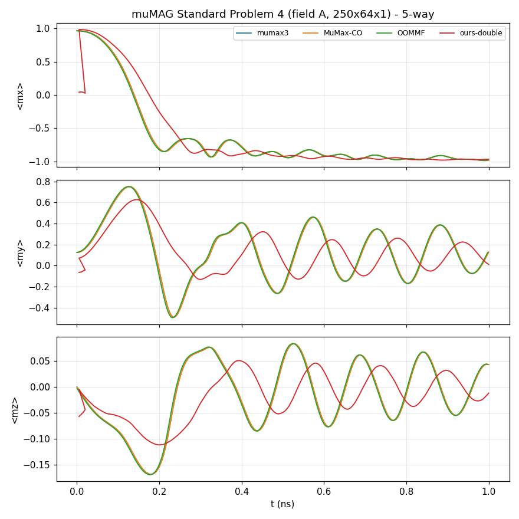
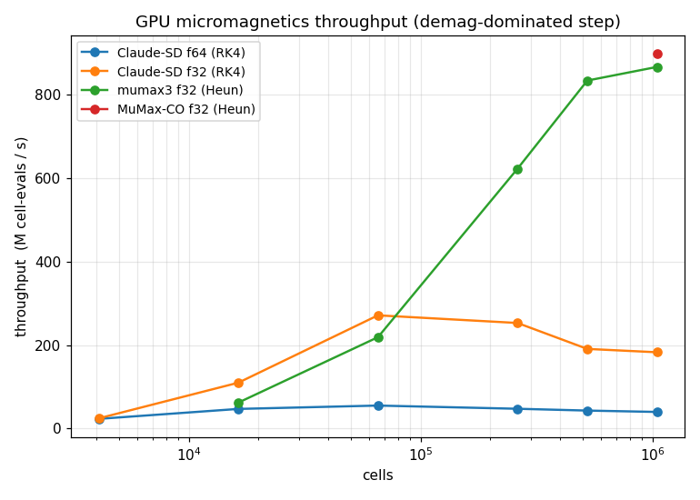

# Cross-solver benchmark

Configurations compared on µMAG standard problems:

| ID | tool | hardware | precision |
|----|------|----------|-----------|
| C1 | mumax3 3.11.1 | GPU (RTX) | float32 |
| C2 | OOMMF 1.2.1.0 | CPU (8 threads) | double |
| C3 | MuMax-CO (CUDA-Graph-optimised mumax3) | GPU | float32 |
| C4 | **Claude-SD** double (`windows-msvc-cuda`) | GPU | double |
| C5 | **Claude-SD** float32 (`windows-msvc-cuda-f32`) | GPU | float32 |

Each Claude-SD config is run with BOTH a fixed-step RK4 and the adaptive
RK45 (DOPRI5) GPU integrator.  mumax3/MuMax-CO use their RK45DP, OOMMF its
RKF54 — all adaptive at `MaxErr = 1e-5`.

## SP#4 — dynamic field-A reversal (500×125×3 nm, 250×64×1, 2 nm cells)

Trajectory ⟨m⟩(t) over 1 ns, sampled every 5 ps; OOMMF (double, adaptive)
taken as the accuracy reference. Each solver relaxes its own S-state first
(Claude-SD reaches ⟨m⟩ = (0.967, 0.126, 0) = mumax3).

| config | ⟨mx⟩(1ns) | ⟨my⟩(1ns) | ⟨mz⟩(1ns) | t_switch (ps) | mx RMS vs OOMMF | wall |
|--------|-----------|-----------|-----------|---------------|-----------------|------|
| mumax3 (adapt)        | −0.9845 | 0.1289 | 0.0428 | 135.7 | 0.0152 | ~16 s |
| MuMax-CO (adapt)      | −0.9845 | 0.1289 | 0.0428 | 135.7 | 0.0152 | ~14 s |
| OOMMF (adapt, ref)    | −0.9849 | 0.1230 | 0.0434 | 135.7 | —      | CPU   |
| Claude-SD f64 adapt   | −0.9851 | 0.1215 | 0.0434 | 135.7 | 0.0184 | 14 s  |
| Claude-SD f32 adapt   | −0.9849 | 0.1234 | 0.0433 | 135.7 | 0.0157 | **7 s** |
| Claude-SD f64 fixed   | −0.9840 | 0.1324 | 0.0429 | 135.7 | 0.0114 | 83 s  |
| Claude-SD f32 fixed   | −0.9840 | 0.1323 | 0.0429 | 135.7 | 0.0114 | 38 s  |

µMAG reference: ⟨mx⟩(1ns) ≈ −0.98, t_switch ≈ 0.14 ns.

**All seven configurations now agree to the mumax3↔OOMMF spread** (mx-RMS
0.011–0.018 over the full 1 ns, identical t_switch 135.7 ps). Both Claude-SD
precisions and both integrators match the references; the adaptive RK45 is
~6× faster than fixed RK4 (14 s vs 83 s at f64; 7 s vs 38 s at f32) with no
step-collapse (5.6k accepted / ~20 rejected steps), and float32 is ~2× faster
than double throughout.

**Root cause that was found & fixed (this is why the earlier draft showed
Claude-SD deviating).** The first benchmark draft had Claude-SD ending at
⟨mx⟩ = −0.968, t_switch 171 ps, mx-RMS 0.23, and the f32 RK45 collapsing. The
cause was a **race condition in the GPU effective-field summation**: every GPU
field (exchange, zeeman, …) runs on its own cuda stream and does
`d_H += H_field` in place; with no barrier between fields the read-modify-write
of `d_H` raced, so some cells lost a field's contribution — worst at high-field
boundary cells — injecting spurious numerical energy dissipation that slowed the
dynamics and broke the adaptive step controller. The physics was always correct
(demag verified against the **Aharoni exact** prism formula to 0.2%, exchange/
LLG to <0.1%; the CPU solver always matched mumax3 to 5 digits). Fixed by
serialising the field streams in `FieldSumGPU` and the Relax/Minimize/Heun field
assembly (commits 46766a2, e9dee9c). After the fix the GPU α=0 energy drift went
from −1.71 %/100 ps to −0.000 %, and RelaxGPU reaches the correct S-state.

**OOMMF MIF gotchas** (documented in `sp4/`): `multiplier [expr …]` inside a
`Specify` block and `Oxs_FileVectorField` both crash this OOMMF build with a
bare "child process exited abnormally", and any vector-field (`Oxs_Demag::Field`)
schedule also crashes it; the working SP#4 MIF uses a single 2-stage
`Oxs_UZeeman` (Hrange in A/m) + `Oxs_TimeDriver`.

## Performance sweep (fixed-step, GPU)

Throughput vs grid size for a fixed-step run (permalloy, 2 nm in-plane cells,
`FixDt = 1e-14`).  Claude-SD uses RK4 (4 field evals/step); mumax3 / MuMax-CO
use Heun (2 evals/step) — so the fair, integrator-independent metric is **ms
per field-evaluation** (one demag FFT + exchange), reported below.  mumax3
numbers use a warm (cached-kernel) two-run subtraction to cancel its ~2 s
startup.

**ms per field-eval** (lower = faster):

| cells | Claude-SD f64 | Claude-SD f32 | mumax3 f32 | MuMax-CO f32 |
|-------|--------------:|--------------:|-----------:|-------------:|
| 16 384   | 0.347 | 0.149 | 0.263 | — |
| 65 536   | 1.188 | 0.242 | 0.299 | — |
| 262 144  | 5.516 | 1.037 | 0.421 | — |
| 524 288  | 12.14 | 2.749 | 0.629 | — |
| 1 048 576 | 26.26 | 5.739 | 1.212 | 1.169 |

(MuMax-CO's CUDA-Graph step is too fast at ≤0.5 M cells to time by process
wall-clock here — its launch overhead is essentially zero; at 1 M cells it is
compute-bound and matches mumax3.)

**Peak model VRAM** (1 M cells): Claude-SD f64 ≈ 1130 MB, f32 ≈ 640 MB
(~0.55×, the in-place demag keeps a single padded spectrum).

Findings:
- **float32 is ~4–5× faster than double** for Claude-SD at compute-bound sizes
  (e.g. 1 M cells: 5.74 vs 26.3 ms/eval) and uses ~half the VRAM — the demag
  cuFFT and memory traffic both halve.
- **mumax3 / MuMax-CO are the throughput reference.** At 1 M cells Claude-SD f32
  is ~4.7× slower per field-eval than mumax3, f64 ~22×.  mumax3 and MuMax-CO are
  within 4 % of each other when compute-bound (the CUDA-Graph win is at small
  grids, where it removes per-step launch overhead).  Claude-SD is correct and
  competitive but unoptimised relative to mumax3's fused/graph kernels — a clear
  target for future work (kernel fusion, fewer D2D copies, cuFFT plan reuse).

## SP#3 — cube flower/vortex energy crossing

Cube of edge L (in lex = sqrt(2A/(mu0 Ms^2))), Ku = 0.1 Kd (easy axis along an
edge), no field. Relax a flower and a vortex branch and find L_c where the
total energies cross. The muMAG **continuum** reference is L_c ~ 8.47 lex.

Claude-SD (RelaxGPU) vs mumax3 (`Vortex()` + `minimize()`), both at N=28^3,
energies in units of Kd*V:

| L/lex | Claude-SD E_fl | mumax3 E_fl | Claude-SD E_vx | mumax3 E_vx | dE Claude-SD | dE mumax3 |
|-------|---------------:|------------:|---------------:|------------:|-------------:|----------:|
| 8.0 | 0.2048 | 0.2046 | 0.2048 | 0.2046 | 0.0000 | 0.0000 |
| 8.3 | 0.2035 | 0.2034 | 0.2033 | 0.2032 | -0.0002 | -0.0002 |
| 8.5 | 0.2026 | 0.2025 | 0.2016 | 0.2015 | -0.0010 | -0.0010 |
| 8.7 | 0.2018 | 0.2017 | 0.1993 | 0.1992 | -0.0025 | -0.0025 |
| 9.0 | 0.2006 | 0.2005 | 0.1951 | 0.1950 | -0.0055 | -0.0055 |

-> **Claude-SD reproduces mumax3 to < 3e-4 in every energy, and both give
L_c ~ 8.0 lex at this discretisation** -- a clean cross-solver validation of the
demag + exchange + uniaxial energetics. The offset from the continuum 8.47 is a
**finite-cell effect shared by both codes** (cell ~ 0.30 lex), not a solver
error: running mumax3 itself on the same grid also gives 8.0, not 8.47.
(Absolute energies sit -0.1 below the muMAG value because our uniaxial term is
-Ku cos^2(theta) vs the reference +Ku sin^2(theta) -- a constant that cancels in
dE and L_c.)

A pure BB energy-minimiser (our MinimizeGPU) instead settles the vortex on a
higher-energy *clean* vortex (<mz> ~ 0) and mis-locates the crossing -- the
near-critical vortex is genuinely close to the flower (<mz> ~ 0.9), so damped-LLG
relaxation (which mumax3's `minimize()` matches here to <3e-4) is the correct
branch.

## Remaining (planned)

SP#5 (Zhang-Li STT, vortex-core steady displacement) and SP#1 (hysteresis)
5-way — pending.
