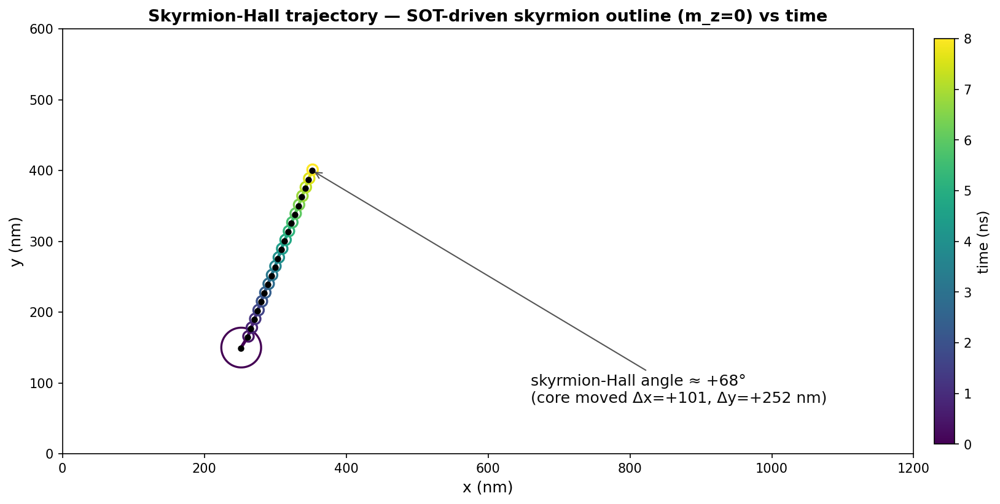
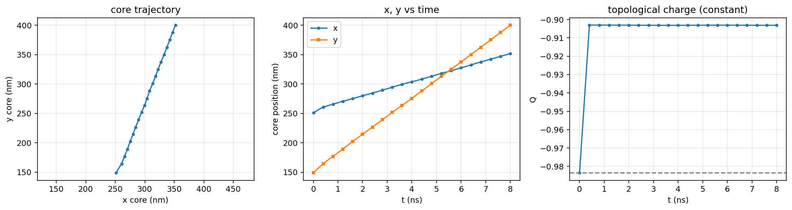

# Skyrmion Hall effect — SOT-driven skyrmion, no annihilation

`examples/skyrmion_hall.py` (GPU). A DMI-stabilized Néel skyrmion in a large
1200 × 600 nm track is relaxed (`MinimizeGPU`, Q = −0.98) and driven by a
spin-orbit torque (σ̂ = ŷ, J = 2.0×10¹¹ A/m², θ_SH = 0.30, α = 0.30). It
translates at **constant velocity** and deflects transversely — the
**skyrmion-Hall effect** — **without annihilating** (Q ≈ −0.90 constant).

## Composite trajectory

The skyrmion outline (`m_z = 0`) at every 0.4 ns snapshot, coloured by time, plus
the core path — a clean straight diagonal at a **skyrmion-Hall angle ≈ 68°**
(core moved Δx ≈ +101 nm, Δy ≈ +252 nm, i.e. ~6× the skyrmion diameter in y).

`x(t)` and `y(t)` are both **linear** (constant velocity); the topological charge
`Q` is conserved throughout — the motion is topologically protected, not a decay.

## Outputs (regenerate: `python examples/skyrmion_hall.py`)

- `paraview_demo/skyrmion_hall/run.pvd` (+ `run_NNNN.vtk`) — ParaView time series
- `snap_NNNN.png` — individual `m_z` + arrow snapshots
- `hall_trajectory.png`, `hall_curves.png` — the figures above

Needs the GPU build (`windows-msvc-cuda`).
